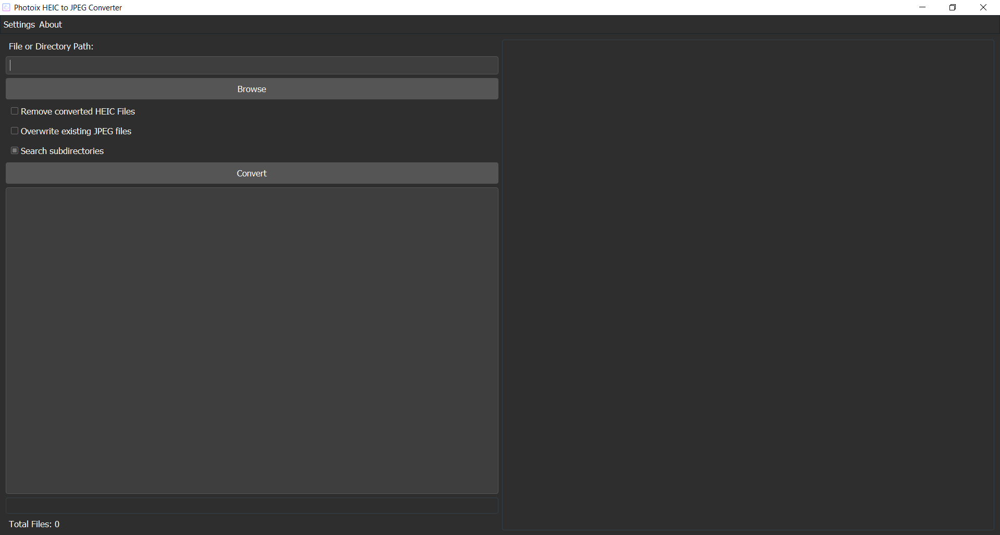
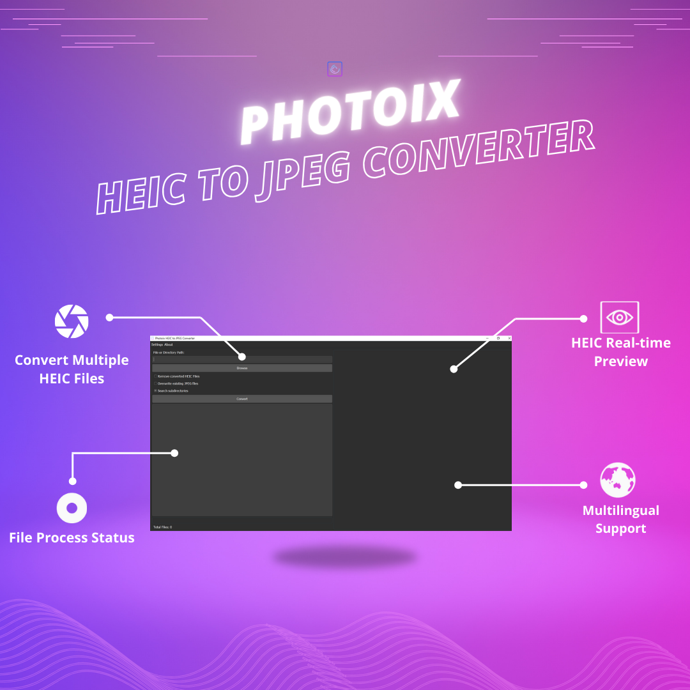

# Photoix HEIC to JPEG Converter



Convert HEIC (High-Efficiency Image Format) files to JPEG format effortlessly with Photoix HEIC to JPEG Converter. This software provides a user-friendly interface powered by PyQt5, designed for simplicity and efficiency in file conversion.

## Features

- **Effortless Conversion**: Convert HEIC files to JPEG format without compatibility issues.
- **Intuitive Interface**: User-friendly GUI that guides through the conversion process.
- **Multilingual Support**: Choose between English and Bangla languages for operation.
- **Progress Tracking**: Visual progress bar and estimated completion time.
- **Comprehensive Feedback**: Detailed console updates and error handling.
- **File Management**: Options to remove original HEIC files and manage output directories.
- **Image Preview**: Preview HEIC images within the application.
- **Developer Information**: Access details about the software and developers via the "About" section.
- **Settings Menu**: Customize conversion preferences and file handling options.

## Screenshots



## Installation

### Clone the Repository
1. Clone the repository:
   ```bash
   git clone https://github.com/SihabSahariar/Photoix-HEIC-to-JPEG-Converter.git

### Install Dependencies
2.  Install dependencies:
	```bash
	pip install -r requirements.txt
	
### Run the Application
3.  Run the application:
	```bash
	python main.py

## Usage

1.  Select a file or directory containing HEIC files.
2.  Customize conversion options in the Settings menu.
3.  Click "Convert" to initiate the conversion process.
4.  Monitor progress and view detailed updates in the console.
5.  Preview and manage Direct HEIC files from the right panel as needed.

## Contributing

Contributions are welcome! For major changes, please open an issue first to discuss what you would like to change.

## License

MIT License

## About

Photoix HEIC to JPEG Converter is developed and maintained by Sihab Sahariar. For inquiries, contact us at sihabsahariarcse@gmail.com.